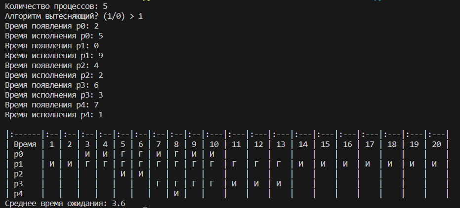

# Лабораторные работы по дисциплине "Организация вычислительных систем"

* Лаба 1 - работа с IP-адресами, перевод в двоичную систему, вычисление класса IP адреса, вычисление маски сети, исходя из необходимого количества хостов и подсетей
* Лаба 4 - реализация алгоритма FCFS (First-Come, First-Served)

* Лаба 5 - реализация алгоритма Round-robin 

* Лаба 6 - реализация алгоритма SJF (Shortest Job First) 

* Лаба 7 - реализация алгоритма SJF с приоритетами

